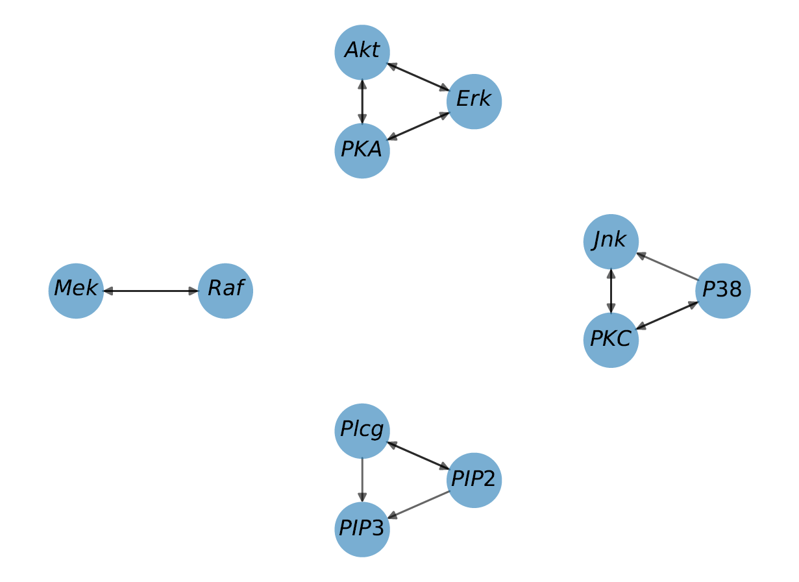
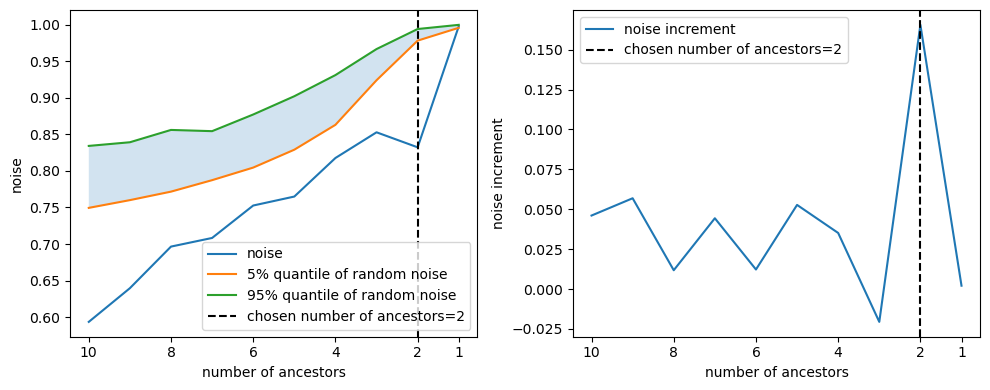
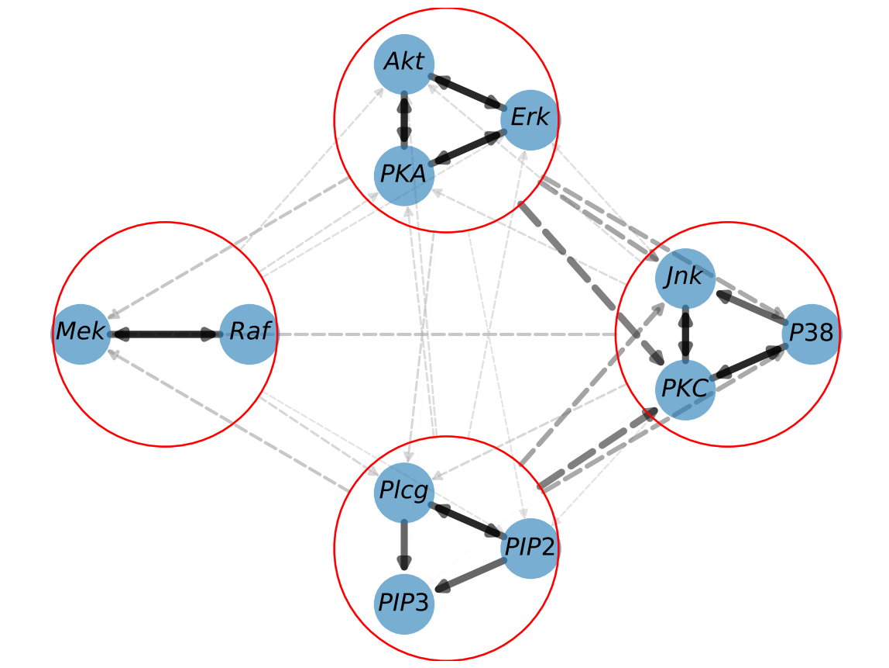

</a>


# Computational Hypergraph Discovery: A Gaussian process framework for connecting the dots

[](https://opensource.org/license/apache-2-0/)
[](https://www.python.org/downloads/release/python-3114/)
[](https://github.com/TheoBourdais/ComputationalHypergraphDiscovery/commits/main)


This is the source code for the paper ["Codiscovering graphical structure and functional relationships within data: A Gaussian Process framework for connecting the dots"][paper_url]. 

Please see the [companion blog post][blog_url] for a gentle introduction to the method and the code.


## Installation 

The code is written in Python 3 and requires the following packages:
- matplotlib
- NumPy
- scipy
- JAX
- networkx

### Using pip

The code is available on [PyPI](https://pypi.org/project/ComputationalHypergraphDiscovery/) and can be installed using pip:

```bash
pip install ComputationalHypergraphDiscovery
```

### From source

After cloning this repo, you install the required packages using pip:
```bash
pip install -r requirements.txt
```

and add the repo to your PYTHONPATH:
```bash
git clone https://github.com/TheoBourdais/ComputationalHypergraphDiscovery.git
export PYTHONPATH=$PYTHONPATH:/path/to/ComputationalHypergraphDiscovery/src
```

## Quick start

Graph discovery takes very little time. The following code runs the method on the example dataset provided in the repo. The dataset is a 2D array of shape (n_samples, n_features) where each row is a sample and each column is a feature. After fitting the model, the graph is stored in the `GraphDiscovery` object, specifically its graph `G` attribute. The graph is a `networkx` object, which can be easily plotted using `.plot_graph()`.

>You can find the Sachs dataset in the repo, at this [link](https://github.com/TheoBourdais/ComputationalHypergraphDiscovery/blob/main/examples/SachsData.csv).
```python
import ComputationalHypergraphDiscovery as CHD
import pandas as pd
df=pd.read_csv('https://github.com/TheoBourdais/ComputationalHypergraphDiscovery/blob/8c3fed6dfe58a01cb73e469579ff7703b0681f7e/examples/Sachs/SachsData.csv?raw=true')
df=df.sample(n=500,random_state=1) #subsample to run example quickly
kernels=[CHD.Modes.LinearMode(),CHD.Modes.QuadraticMode()]
graph_discovery = CHD.GraphDiscovery.from_dataframe(df,kernels=kernels)
graph_discovery.fit()
graph_discovery.plot_graph()
```

You should obtain the following graph (note that it will slightly differ from the graph in the paper due to the subsampling):

</a>


## Available modifications of the base algorithm

The code gives an easy-to-use interface to manipulate the graph discovery method. It is designed to be modular and flexible. The main changes you can make are
- **[Kernels and modes](#manipulating-kernels)**: You can decide what type of function will be used to link the nodes. The code provides a set of kernels, but you can easily add your own. The interface is designed to resemble the scikit-learn API, and you can use any kernel from scikit-learn. 
- **[Decision logics](#manipulating-decision-logics)**: In order to identify the edges of the graph, we need to decide whether certain connections are significant. The code provides indicators (like the level of noise), and the user specifies how to interpret them. The code provides a set of decision logic, but you can define your own. 
- **[Clustering](#manipulating-clusters-and-possible-edges)**: If a set of nodes is highly dependent, it is possible to merge them into a cluster of nodes. This gives greater readability and prevents the graph discovery method from missing other connections. 
- **[Possible edges](#manipulating-clusters-and-possible-edges)**: If you know that specific nodes cannot be connected, you can specify it to the algorithm. By default, all edges are possible. 


## The Base algorithm

In order to initiate the graph discovery method, you need to create a `GraphDiscovery` object. The main parameters are:
- **Essential parameters**:
    - `X`: The data used to fit the model. It is a 2D array of shape (n_features,n_samples) where each row is a feature and each column is a sample.
    - `node_names`: The names of the nodes. It is a list of strings of length n_features.
- **Refinements**:
    - `kernels`: The kernels used to link the nodes. If none is provided, a default kernel is used. See the section on [manipulating kernels](#manipulating-kernels) for more details.
    - `cluster` and `possible_edges`: additional features to inform the graph discovery process and refine the recovery. See the section on [manipulating clusters and possible edges](#manipulating-clusters-and-possible-edges) for more details.
- **Optional**:
    - `verbose`: to choose whether to print information during the fitting process.


Here is an example:


```python
import ComputationalHypergraphDiscovery as CHD
import numpy as np
X=np.random.rand(10,100)
node_names=[f'node_{i}' for i in range(10)]
graph_discovery = CHD.GraphDiscovery(X,node_names)
```

> **Note**: This shows how to create a `GraphDiscovery` object from a numpy array. If you want to follow this tutorial, use the Sachs dataset provided in the repo as a reference. You can use the code below to load it:

If you have a Pandas dataframe, you can use the `from_dataframe` method (see the method's docstring for more details):

```python
import ComputationalHypergraphDiscovery as CHD
import pandas as pd
df=pd.read_csv('https://github.com/TheoBourdais/ComputationalHypergraphDiscovery/blob/8c3fed6dfe58a01cb73e469579ff7703b0681f7e/examples/Sachs/SachsData.csv?raw=true')
df=df.sample(n=500,random_state=1) #subsample to run example quickly
graph_discovery = CHD.GraphDiscovery.from_dataframe(df)
```

Once the object is created, you can fit the model using the `.fit()` method. The fit method takes the following parameters: 
- **Essential parameters**:
    - `targets`: Which nodes you wish to discover the ancestors of. By default, we recover the ancestors of all nodes. 
- **Refinements**:
    - `kernel_chooser` and `mode_chooser`: Decision logic to refine the graph discovery process. See the section on [manipulating decision logics](#manipulating-decision-logics) for more details.
- **Optional** (better left as default):
    - `gamma`: The noise parameter of the kernel. By default, it is automatically estimated. We advise against setting it manually, as a good choice of gamma is crucial for the performance of the algorithm and is unintuitive to find.
    - `gamma_min`: The minimum value of gamma when finding it automatically. By default, it is `1e-9`. This is necessary for numerical stability.

Here is an example:
```python
graph_discovery.fit()
```
If you wish to discover the ancestors of a specific node, you can do so by specifying the `targets` parameter:
```python
graph_discovery.fit(targets=['$Raf$'])
```

Once the model is fitted, you can access all the results of the graph discovery using the `.G` attribute. It is a `networkx` object, and you can use any of the methods provided by `networkx`. For example, you can plot the graph using the `.plot_graph()` method:
```python
graph_discovery.plot_graph()
```

>The `.plot_graph()` method allows for some customization of the resulting plot. See the method's docstring for more details on available parameters. 


> **Disclaimer**: Note that the data is assumed to be real numbers. The algorithm only accepts data in the form of a 2D array of shape (n_samples,n_features). Other shapes will be rejected, and other types of data will be treated as real numbers.


## Manipulating kernels

The kernel is the function used to define the type of functions that will link the nodes. The code provides a set of kernels, but you can easily add your own. The interface is designed to ressemble the scikit-learn API, and you can use any kernel from scikit-learn. 

> **Definitions**: a kernel is a function $k$ such that $k(x,y)=\langle \phi(x),\phi(y)\rangle$ for some feature map $\phi$. it allows the definition of a similarity measure between two points and enhances the expressivity of the model. We use kernels extensively in this project and will define some terms here:
> - **Kernel**: a function $k$ used to perform the downstream ML task (here, identify the ancestors). 
> - **Kernel Matrix**: Given a kernel $k$ and a dataset $X$ of shape (n_features,n_samples), the kernel matrix is a matrix of shape (n_samples,n_samples) defined by $K_{i,j}=k(X_i, X_j)$.
> - **Kernel Mode**: A kernel mode is a kernel itself that is used to form a sum kernel (if $k=k_1+k_2$, $k_1$ and $k_2$ are kernel modes of $k$)
> - **Kernel Mode Matrix**: Given kernel modes $k_1,..,k_p$ of $k$ ($k=k_1+..+k_p$) and a dataset $X$ of shape (n_features,n_samples), the kernel mode matrix is a matrix of shape (p,n_samples,n_samples) defined by $K_{l, i,j}=k_l(X_i, X_j)$ where $k_l$ is the ith kernel mode of $k$. We have $K_{i,j}=k(X_i,X_j)=\sum_{l=1}^p K_{l,i,j}$. 

To manipulate kernels, import the modes module:
```python
import ComputationalHypergraphDiscovery.Modes as Modes
```


The `ModeKernel` interface defines our kernel modes. An example of a kernel mode is the `LinearMode` class, which implements the linear kernel that can be used as a mode. Currently, we only provide the 3 kernels used in the paper, applied to $x$ and $y$ that are rows of our dataset:
- **LinearMode**: The linear kernel. 
    - not interpolatory 
    - $\kappa_{\text{linear}}(x,y)=1+\langle x,y\rangle$
    - Call: `Modes.LinearMode()`
- **QuadraticMode**: The quadratic kernel. 
    - not interpolatory 
    - $\kappa_{\text{quadratic}}(x,y)=(1+\langle x,y\rangle)^2$ (only implemented for $x_1,y_1,x_2,y_2\in\mathbb{R}$).
    - Call: `Modes.QuadraticMode()`
- **GaussianMode**: The Gaussian kernel. 
    - interpolatory 
    - has hyperparameter `l` the lengthscale
    - $\kappa_{\text{gaussian}}(x,y)=\kappa_{\text{quadratic}}(x,y)+\prod_{i=1}^p (1+\exp(-(x_i-y_i)^2/(2l^2)))$ only implemented for $x,y\in\mathbb{R}$.
    - Call: `Modes.GaussianMode(l=1)`


>### Interpolatory: 
>
>A kernel $k(x,y)=\langle\phi(x),\phi(y)\rangle$ will be interpolatory if its associated feature map $\phi$ has more dimensions than the number of data points. For example, the Gaussian kernel is interpolatory (its feature map is infinite-dimensional), while the linear kernel will probably not be (if the input is of dimension d, the number of data points is n, if n>d the kernel is not interpolatory). 


> **Caution**: We have defined here a kernel with 3 modes: one linear, one quadratic, and one Gaussian. However, for the overall algorithm to work, we prefer to define the 3 following hierarchical modes:
> - Linear mode
> - Linear + quadratic mode
> - Linear + quadratic + Gaussian mode
>
> This allows us to have modes of increasing complexity so that when we change mode, the new one is strictly more expressive than the previous one (this means we widen the search as we progress)


## Manipulating decision logics

In order to identify the edges of the graph, we need to decide whether certain connections are significant. The code provides indicators (like the level of noise), and the user specifies how to interpret them. The functions used to make these decisions are available in the `decision` module.

```python
import ComputationalHypergraphDiscovery.decision as decision
```

There are two leading indicators that we use to make decisions (See the [paper][paper_url] or the [blog post][blog_url] for more details):
- **Signal-to-noise ratio**: The signal-to-noise ratio is a measure of how much the signal is stronger than the noise. We also use its complementary value, the noise-to-signal ratio. Here, it indicates the amount of noise we measure in the data given a set of ancestors. If there is a lot of noise, this means the current set of ancestors doesn't explain well the node (and thus there are not true ancestors). 
- **Z_test**: The Z_test is a statistical test that allows to test if the signal-to-noise ratio we obtained is statistically significant.

There are three types of decisions to be made in the algorithm:
- **Kernel chooser**: Chooses if a node has ancestors and with which kernel.
- **Mode chooser**: Chooses the ancestors of a mode

### Kernel chooser
The first decision to make is to decide if a node has ancestors or not, as well as the kernel with which the node has ancestors. To do so, we compute the signal-to-noise ratio and the `Z_test` for each kernel. We get the following performances:

An example of output is the following dictionary (some keys have been hidden for clarity):
```python
kernel_performances={
  'linear': {
    'noise-to-signal ratio': 0.45,
    'Z_test': [0.98, 1.0]
    },
  'quadratic': {#see note above, this is not the quadratic kernel but linear+quadratic
    'noise-to-signal ratio': 0.91, 
    'Z_test': [0.96, 1.0]
    }, 
  'gaussian': {#same comment as above
    'noise-to-signal ratio': 0.33, 
    'Z_test': [0.74, 1.0]
    }
}
```

Several decisions can be made using this dictionary. Decisions are made by instances of the `KernelChooser` class. 
- **Threshold**: 
    - Implemented in `ThresholdKernelChooser`. 
    - Choose an amount of noise that is acceptable, and choose the simplest kernel that has a noise-to-signal ratio below this threshold. 
    - If the threshold is too low, no kernel will be chosen 
    - In the example, with a threshold of 0.5 (i.e., half of the data is noise, half is signal), the linear kernel is chosen.
-  **Minimum noise**:
    - Implemented in `MinNoiseKernelChooser`.
    - Choose the kernel that has the lowest noise such that the noise is not in the `Z_test` interval (which would mean the noise ratio is not statistically significant).
    - If no kernel has a noise ratio that is not statistically significant, no kernel is chosen.
    - In the example, the Gaussian kernel is chosen.

### Mode chooser

Once we have chosen a kernel, we need to select the ancestors of the node. To do so, we remove the ancestors one by one and compute the signal-to-noise ratio and the `Z_test` after each removal. The evolution of the signal-to-noise ratio and the `Z_test` gives the following graph: 

</a>

As we remove ancestors, it becomes harder to explain the node from the remaining ancestors. Seeing the evolution of the signal-to-noise ratio and the `Z_test`, we must choose how many ancestors we wish to keep. 

>**Note**: One good indicator of when we have removed an essential ancestor is when we observe a spike in the noise ratio. This is why increments in the noise ratio are plotted on the right, as it is a good indicator. 

Several decisions can be made from this evolution. By default, we use `MaxIncrementModeChooser`. Decisions are made by instances of the `ModeChooser` class:
- **Threshold**: 
    - Implemented in `ThresholdModeChooser`. 
    - Choose a threshold for the noise ratio, and keep the ancestors until the noise ratio goes above this threshold.
    - In the example, with a threshold of 0.7, we would keep 8 ancestors.
- **Maximum increment**: 
    - Implemented in `MaxIncrementModeChooser`. 
    - We look at the highest spike in the noise ratio and keep the ancestors we had at the moment of this spike.
    - In the example, we see the spike occurs at 2 ancestors, so we keep these 2 ancestors. 

## Manipulating clusters and possible edges

### Clusters

If a set of nodes is highly dependent, it is possible to merge them into a cluster of nodes. This gives greater readability and prevents the graph discovery method from missing other connections. It also lets you perform graph discovery in a hierarchical fashion:
1. Run CHD once on all nodes
2. Identify clusters of nodes: if a set of nodes is highly dependent, with strong (i.e., low noise) connections, merge them into a cluster of nodes.
3. Run CHD with clusters

>An example of the use of clusters is given in the [Gene notebook](./examples/Gene_graph_discovery.ipynb)

### Cluster definition

#### When creating a `GraphDiscovery` object

When creating a `GraphDiscovery` object, you can specify the `cluster` parameter. It is a list of lists of strings, where each list of strings is a cluster of nodes. For example, with the Sachs dataset, we can define the following clusters:
```python
clusters=[
    ['$PKC$','$P38$','$Jnk$'],
    ['$Erk$','$Akt$','$PKA$'],
    ['$Raf$','$Mek$'],
    ['$Plcg$','$PIP2$','$PIP3$']
]
graph_discovery = CHD.GraphDiscovery.from_dataframe(df,clusters=clusters)
```

#### After creating a `GraphDiscovery` object, for the second run

If you already have a `GraphDiscovery` object named `graph_discovery` on which you have run the algorithm, you can choose the clusters based on the results and apply them to get a new `GraphDiscovery` object:
```python
graph_discovery2=graph_discovery.prepare_new_graph_with_clusters(clusters)
```

### Using clusters
Once the clusters have been defined, you can use the `GraphDiscovery` object as usual. It will handle the clustering you specified and will plot the graph showing clusters. 
We advise using clusters in a multi-level fashion, as is demonstrated here.
```python
import numpy as np
import ComputationalHypergraphDiscovery as CHD
from ComputationalHypergraphDiscovery.Modes import *

# Load the data
data = np.loadtxt('data/Sachs.txt', delimiter='\t')
# Normalize the data
data = (data - np.mean(data, axis=0)) / np.std(data, axis=0)
node_names=np.array(['$Raf$','$Mek$','$Plcg$','$PIP2$','$PIP3$','$Erk$','$Akt$','$PKA$','$PKC$','$P38$','$Jnk$'])

# Define the kernel
kernel = [0.1*LinearMode(), 0.01*QuadraticMode()]
# Set up CHD
graph_discovery = CHD.GraphDiscovery(data,node_names,kernel)
# Perform CHD
graph_discovery.fit()
graph_discovery.plot_graph()

# Refine the graph with clusters
clusters=[
    ['$PKC$','$P38$','$Jnk$'],
    ['$Erk$','$Akt$','$PKA$'],
    ['$Raf$','$Mek$'],
    ['$Plcg$','$PIP2$','$PIP3$']
]
graph_discovery2=graph_discovery.prepare_new_graph_with_clusters(clusters)
graph_discovery2.fit()
graph_discovery2.plot_graph()
```
This code recovers the following graph:

</a>

### Possible edges

As a practitioner, you may have some knowledge about the data that you wish to use to inform the graph discovery process. For example, you may know that specific nodes cannot be connected. You can specify this information to the algorithm using the `possible_edges` parameter of the `GraphDiscovery` object. This is a directed graph in the form of a `networkx.DiGraph` object. Graph discovery will ignore all connections that are not in the `possible_edges` graph. An example of use is given in the [chemistry notebook](./examples/ChemistryNew.ipynb). 


<!-- links -->

[paper_url]: https://www.pnas.org/doi/10.1073/pnas.2403449121
[blog_url]: https://theobourdais.github.io/posts/2023/11/CHD/
